# x86-win10-cpp-onnxruntime测试

⌚️: 2021年8月1日

📚参考

- [安装环境时参考官方](https://www.onnxruntime.ai/docs/how-to/install.html)

---

## 一、环境准备

### 1. VS2017安装

略

### 2. VS2017新建项目

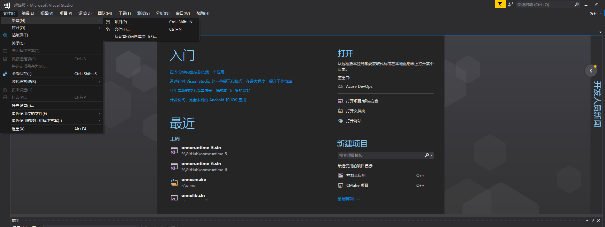

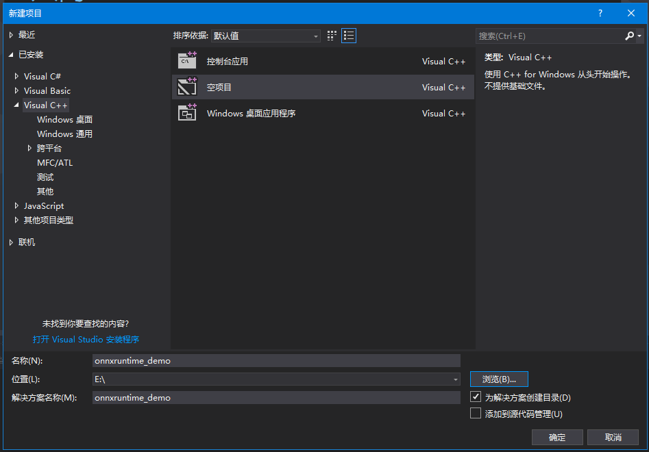


### 3. 安装onnxruntime

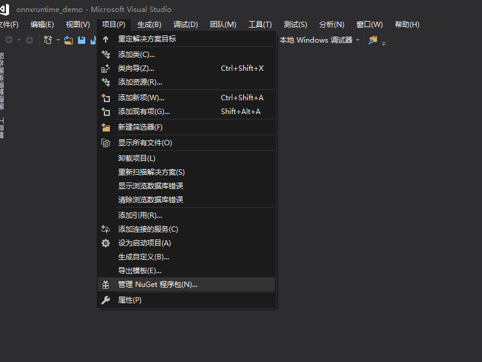

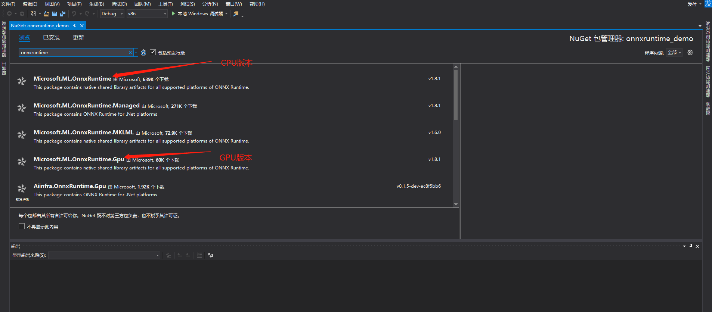

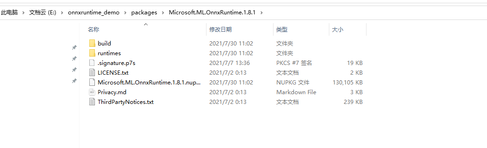


### 4. 配置opencv

编译安装略

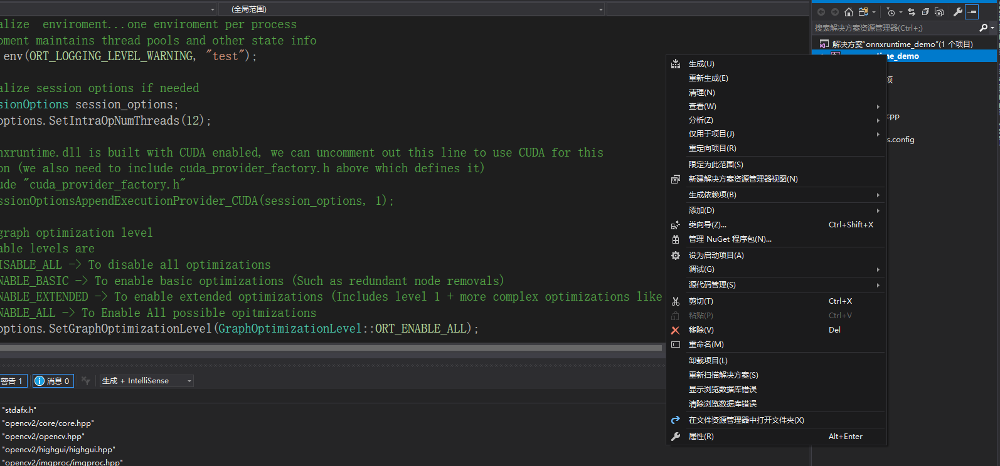

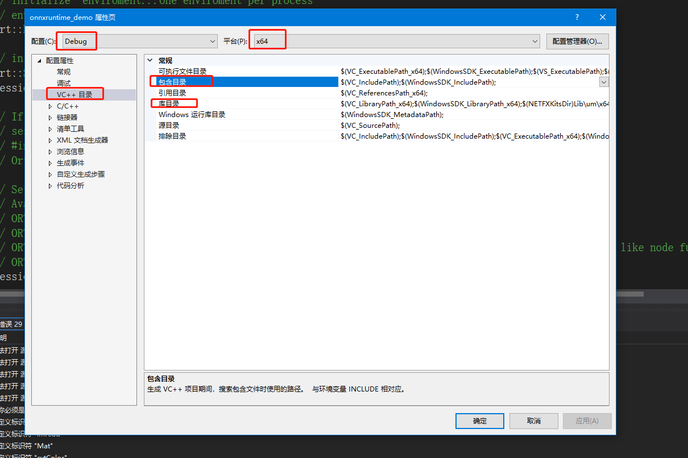

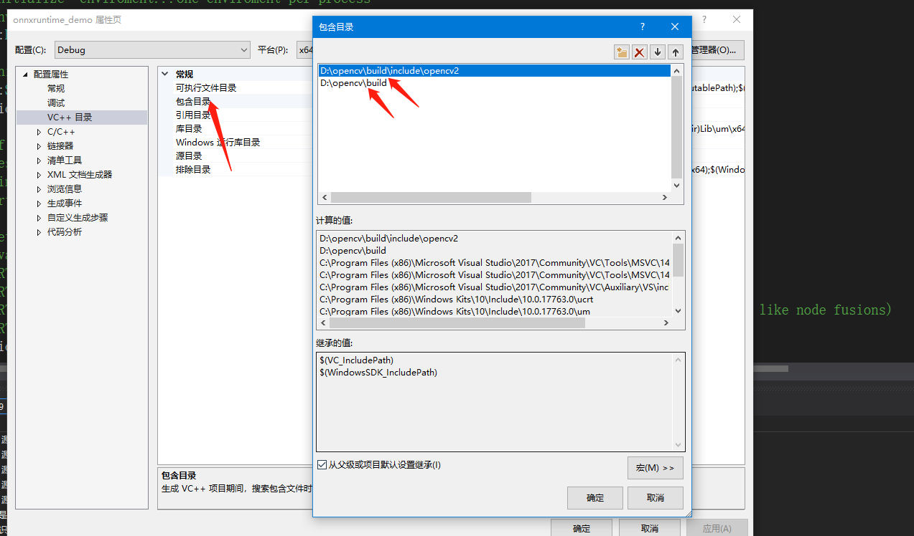

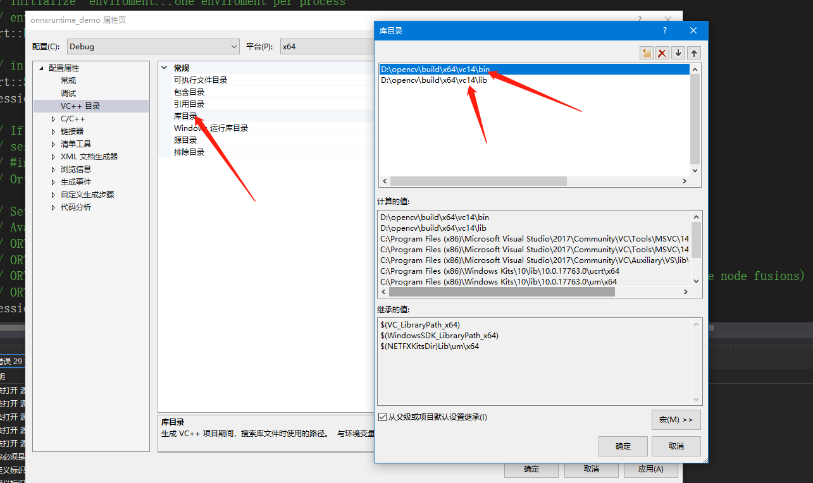

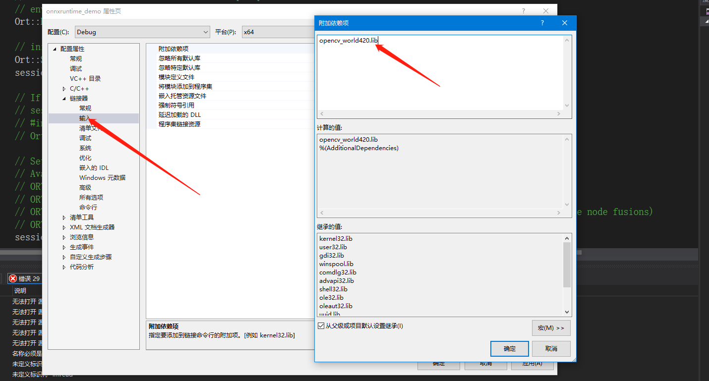

**一定要做好版本匹配**

## 二、运行代码

### 1. 代码结构

```
--x86_windows
----cpp
------onnxruntime_demo
--------main.cpp
--------stdafx.h
--------targetver.h
```

上述代码需要使用`一、环境准备`的步骤大家环境，然后才能使用。

### 2. 代码执行

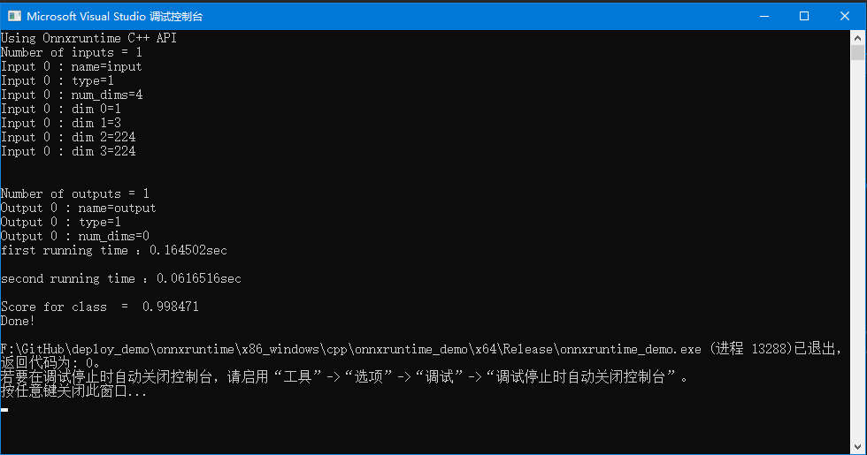