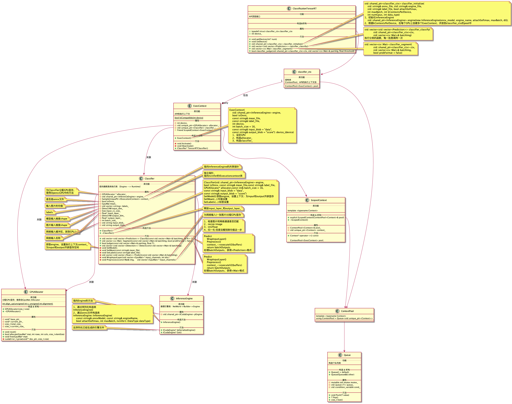

# x86-ubuntu-cpp-tensorrt-gpu测试

⌚️: 2021年8月1日

📚参考

- **[官方安装教程](https://docs.nvidia.com/deeplearning/tensorrt/install-guide/index.html#installing)**

---

## 一、环境准备

以下是**Docker环境搭建过程**，且过程为**训练环境搭建**。 在裸机上安装的步骤一样

### 1. 训练环境搭建

#### 1.1 pull镜像

**on host**

`docker pull nvidia/cuda:10.2-cudnn8-devel-ubuntu18.04`

`docker run -itd -v /home/felixfu/cds/:/root/cds -v /home/felixfu/Downloads/:/root/Downloads -p 5901:22 -p 6006:6006 --name cds nvidia/cuda:10.2-cudnn8-devel-ubuntu18.04`

`docker exec -it cds bash`

#### 1.2 ssh

**in container**

`apt update`

`apt install ssh vim -y` 修改ssh配置文件，使得远程可以连接 & passwd修改密码（felixfu）

`service ssh restart`

#### 1.3 python

`apt install python python3 python-pip python3-pip -y`

```shell
rm /usr/bin/python
ln -s /usr/bin/python3
ln -s /usr/bin/python3 /usr/bin/python
root@1b1202af2526:/# python -V
Python 3.6.9
root@1b1202af2526:/# pip -V
pip 9.0.1 from /usr/lib/python3/dist-packages (python 3.6)
```

#### 1.4 torch

```shell
pip3 install torch torchvision torchaudio -i https://pypi.tuna.tsinghua.edu.cn/simple
pip3 install --upgrade pip
pip install -i https://pypi.tuna.tsinghua.edu.cn/simple matplotlib opencv-python Pillow tensorboard 
pip install -i https://pypi.tuna.tsinghua.edu.cn/simple scikit-learn scikit-image tqdm
```

```angular2html
import cv2 
ImportError: libGL.so.1: cannot open shared object file: No such file or directory
apt update
apt install libgl1-mesa-glx
```

#### 1.5 commit image

**on host**

```
docker commit 1b fusimeng/cds:cuda10.2-torch1.8.1
docker push fusimeng/cds:cuda10.2-torch1.8.1
```

### 2. opencv(GPU)

#### 2.1 image & tools

**on host**

```angular2html
docker run -itd -v /home/felixfu/cds/:/root/cds -v /home/felixfu/Downloads/:/root/Downloads -v /home/felixfu/data:/root/data -p 5901:22 -p 6006:6006 --name cds fusimeng/cds:cuda10.2-torch1.8.1
docker exec -it cds bash
```

**in container**

```angular2html
apt-get install inetutils-ping
apt-get install net-tools -y  
apt install git -y
```

#### 2.2 cmake

https://github.com/FelixFu520/README/blob/main/envs/tools/cmake.md

#### 2.3 gstreamer(未用到)

```angular2html
apt-get install libgstreamer*
```

### 2.4 opencv(GPU)

https://github.com/FelixFu520/README/blob/main/envs/tools/opencv_gpu.md

### 3 Clion

https://github.com/FelixFu520/README/blob/main/envs/tools/clion.md

### 4 TensorRT（C++）

https://github.com/FelixFu520/README/blob/main/envs/tools/tensorrt.md

### 5 TensorRT（Python）

```angular2html
pip install onnx onnxruntime pycuda
pip install tensorrt-7.2.2.3-cp36-none-linux_x86_64.whl
```

运行onnx2trt.py时会报，`ImportError: libnvinfer.so.7: cannot open shared object file: No such file or directory`错误。

解决：https://blog.csdn.net/xulingjie_online/article/details/113943508

python整体环境：

```angular2html
root@cbd2d316feeb:~# pip list
Package                 Version
----------------------- ---------------
absl-py                 0.12.0
appdirs                 1.4.4
asn1crypto              0.24.0
cachetools              4.2.2
certifi                 2018.1.18
chardet                 3.0.4
cryptography            2.1.4
cycler                  0.10.0
dataclasses             0.8
decorator               4.4.2
google-auth             1.30.0
google-auth-oauthlib    0.4.4
grpcio                  1.37.1
idna                    2.6
imageio                 2.9.0
importlib-metadata      4.0.1
joblib                  1.0.1
keyring                 10.6.0
keyrings.alt            3.0
kiwisolver              1.3.1
Mako                    1.1.4
Markdown                3.3.4
MarkupSafe              1.1.1
matplotlib              3.3.4
networkx                2.5.1
numpy                   1.19.5
oauthlib                3.1.0
onnx                    1.9.0
onnxruntime             1.7.0
opencv-python           4.5.2.52
Pillow                  8.2.0
pip                     21.1.1
protobuf                3.16.0
pyasn1                  0.4.8
pyasn1-modules          0.2.8
pycrypto                2.6.1
pycuda                  2021.1
pygobject               3.26.1
pyparsing               2.4.7
python-apt              1.6.5+ubuntu0.5
python-dateutil         2.8.1
pytools                 2021.2.6
PyWavelets              1.1.1
pyxdg                   0.25
requests                2.25.1
requests-oauthlib       1.3.0
rsa                     4.7.2
scikit-image            0.17.2
scikit-learn            0.24.2
scipy                   1.5.4
SecretStorage           2.3.1
setuptools              56.1.0
six                     1.11.0
ssh-import-id           5.7
tensorboard             2.5.0
tensorboard-data-server 0.6.1
tensorboard-plugin-wit  1.8.0
tensorrt                7.2.2.3
threadpoolctl           2.1.0
tifffile                2020.9.3
torch                   1.8.1
torchaudio              0.8.1
torchsummary            1.5.1
torchvision             0.9.1
tqdm                    4.60.0
typing-extensions       3.10.0.0
unattended-upgrades     0.1
urllib3                 1.22
Werkzeug                1.0.1
wheel                   0.30.0
zipp                    3.4.1
```


## 二、运行代码

### 1. 代码结构

```
--tensorrt_cpp
----CMakeLists.txt
----main.cpp
----classifier
-------classification.cpp
-------classification.h
-------CMakeLists.txt
-------gpu_allocator.cpp
-------gpu_allocator.h
-------trtCommon.h
```

上述代码需要使用`一、环境准备`的步骤大家环境，然后才能使用。
执行结果 略

