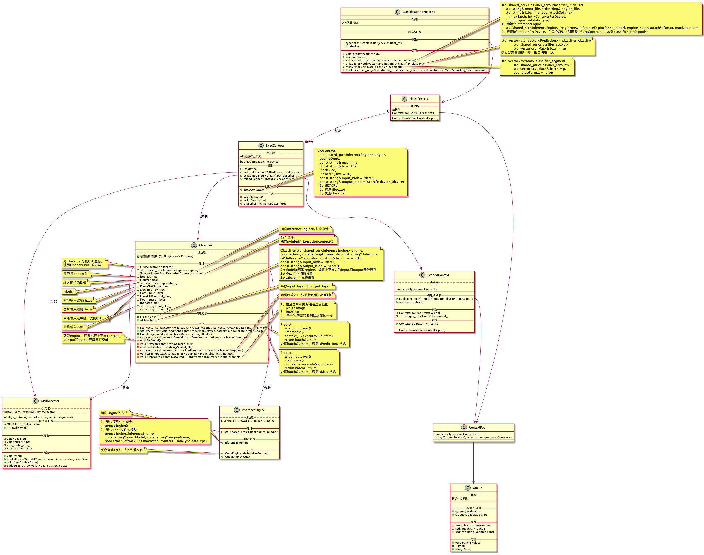

# x86-win10-cpp-tensorrt-gpu测试

⌚️: 2021年8月1日

📚参考

---

## 一、环境准备
### 1.Opencv GPU 编译
略，请百度

### 2.TensorRT windows编译
略，请百度或者参考[这里](https://github.com/FelixFu520/README/blob/main/envs/tools/tensorrt_win10.md)
### 3. VS环境配置
在VS2017中添加OpencvGPU和TensorRT的库

## 二、运行代码

### 1. 代码结构

```
--trt_cpp
----CMakeLists.txt
----main.cpp
----classification.cpp
----classification.h
----gpu_allocator.cpp
----gpu_allocator.h
----trtCommon.h
----utils.h
----network.h
----plugin_factory.h
```


